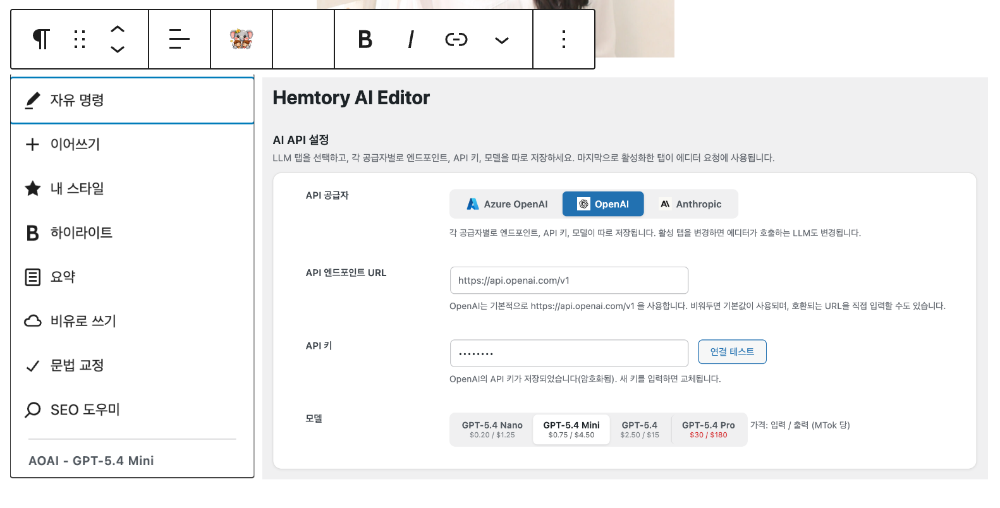
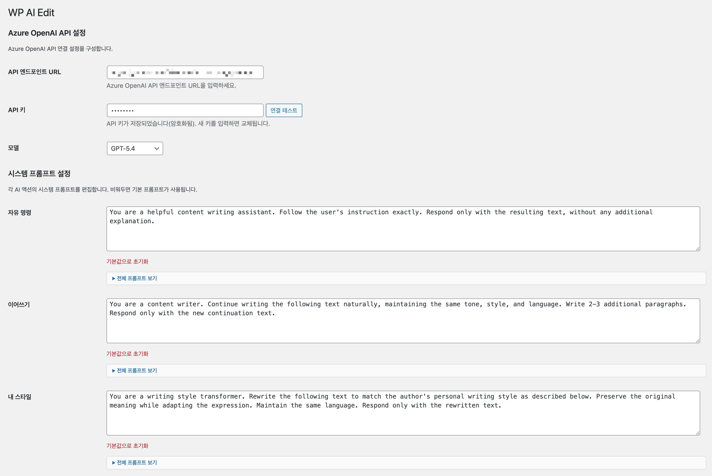

# Hemtory AI Editor

**AI-powered content editing for the WordPress Gutenberg editor.**

자신이 보유한 Azure OpenAI, OpenAI, Anthropic API 키 하나로 Gutenberg 블록 에디터에 AI의 힘을 부여하세요. 별도의 SaaS 구독 없이, 내 API 키와 모델을 직접 연결하여 글쓰기, 교정, 요약, SEO 분석, 이미지 분석까지 에디터 안에서 바로 수행할 수 있습니다.

Bring the power of AI to your Gutenberg editor with your own API key. No separate SaaS subscription required — just connect your Azure OpenAI, OpenAI, or Anthropic key and unlock writing, proofreading, summarizing, SEO analysis, and image description directly inside the editor.

## 에디터 액션 메뉴 / Editor Action Menu




## 만든 계기 / Why This Exists

이 플러그인은 IT와 생성형 AI에 익숙하지 않은 Hemtory 주부가 WordPress로 블로그를 시작하면서, 글을 더 쉽고 편하게 다듬을 수 있도록 만들었습니다. 복잡한 도구를 배우기보다 익숙한 Gutenberg 에디터 안에서 바로 AI 기능을 쓰는 데 초점을 맞췄고, 설정 화면에서 프롬프트와 동작 방식을 입맛에 맞게 조정할 수 있도록 구성했습니다.

This plugin was created to help Hemtory start blogging with WordPress more comfortably. The goal was to keep AI features inside the familiar Gutenberg editor instead of forcing a separate workflow, while still allowing behavior and prompts to be customized from the settings screen.

현재는 Azure OpenAI, OpenAI, Anthropic(Claude)을 모두 지원하며, 각 공급자별로 API 키와 모델을 독립 관리합니다.

The plugin now supports Azure OpenAI, OpenAI, and Anthropic (Claude), with independent API key and model management per provider.

## 화면 미리보기 / Screenshots

### 설정 화면 / Settings Screen



---

## 기능 / Features

| 액션 | Action | 설명 / Description |
|------|--------|--------------------|
| 자유 명령 | Your Command | 자유 텍스트 지시로 AI에 명령 / Give free-text instructions to the AI |
| 이어쓰기 | Write More | 같은 톤과 스타일로 글 이어쓰기 / Continue writing with the same tone and style |
| 내 스타일 | My Style | 프롬프트에 정의한 개인 문체로 변환 / Rewrite text to match your personal writing style |
| 하이라이트 | Highlight | 핵심 구문에 `<strong>`, `<em>` 태그 적용 / Mark key phrases with HTML emphasis tags |
| 요약 | Summarize | 긴 텍스트를 핵심 요점으로 압축 / Condense long text into key points |
| 비유로 쓰기 | Write Analogy | 비유와 은유로 텍스트 재구성 / Rewrite using metaphors and analogies |
| 문법 교정 | Fix Grammar | 문법, 맞춤법, 구두점 수정 / Correct grammar, spelling, and punctuation |
| SEO 도우미 | SEO Helper | 전체 문서 분석 → 제목 3개, 키워드 5개, 100자 요약 / Analyze entire document for titles, keywords, and summary |

### 이미지 분석 / Image Analysis

이미지 블록을 선택하면 AI 버튼이 툴바에 나타나며, 다음 액션을 사용할 수 있습니다. 결과는 이미지 하단에 새 단락 블록으로 삽입됩니다.

When you select an image block, the AI button appears in the toolbar with the following actions. Results are inserted as a new paragraph block below the image.

| 액션 | Action | 설명 / Description |
|------|--------|--------------------|
| 자유 명령 | Your Command | 이미지에 대해 자유 텍스트 지시 / Give free-text instructions about the image |
| 이미지 설명 | Describe Image | 이미지의 시각적 요소, 구성, 색상, 분위기를 상세 설명 / Describe visual elements, composition, colors, and mood |
| 캡션 제안 | Suggest Caption | 블로그/기사에 적합한 간결한 캡션 생성 / Generate a concise, engaging caption for blog posts |

> **Vision 지원**: OpenAI/Azure OpenAI는 `image_url` 방식, Anthropic은 서버에서 이미지를 다운로드하여 `base64` 인코딩 방식으로 처리합니다.
>
> **Vision support**: OpenAI/Azure uses `image_url`, Anthropic downloads and encodes images as `base64` on the server side.

### 플랫폼 기능 / Platform Features

- **실시간 스트리밍** — SSE 기반 AI 응답 실시간 표시 / Real-time streaming AI responses via SSE
- **Gutenberg HTML 출력** — Tail Prompt로 에디터 호환 HTML 포맷 보장 / Gutenberg-compatible HTML output via configurable Tail Prompt
- **프롬프트 커스터마이징** — 액션별 시스템 프롬프트 편집 + 전체 프롬프트 미리보기 / Customizable system prompts per action with full prompt preview
- **멀티 LLM 탭 관리** — Azure OpenAI, OpenAI, Anthropic 설정을 각각 저장하고 마지막 활성 탭 기준으로 호출 / Manage Azure OpenAI, OpenAI, and Anthropic settings independently with tab-based activation
- **이미지 분석** — 이미지 블록 선택 시 Vision API로 설명/캡션 생성, 하단에 새 단락 삽입 / AI image analysis with description and caption generation via Vision API
- **멀티 블록 선택** — 여러 블록을 동시에 선택하여 AI 처리 / Works with single and multiple block selection
- **API 키 암호화** — libsodium 기반 암호화 저장 / API key encryption using libsodium
- **보안** — DOMPurify XSS 방지, SSRF 엔드포인트 검증, Rate Limit / DOMPurify XSS protection, SSRF endpoint validation, rate limiting
- **다국어 지원** — 한국어(ko_KR) 번역 포함 / Korean (ko_KR) translation included

---

## 요구 사항 / Requirements

- WordPress 6.4+
- PHP 8.3+
- Azure OpenAI API endpoint and key, OpenAI API key, or Anthropic API key

---

## 설치 / Installation

### 방법 1: ZIP 업로드 / ZIP Upload

1. `releases/` 디렉토리의 `hemtory-ai-editor.zip` 또는 [Releases](https://github.com/studydev/wp-ai-edit/tree/main/releases) 페이지에서 zip 파일을 다운로드합니다.
2. WordPress 관리자 → **플러그인** → **새로 추가** → **플러그인 업로드**로 ZIP을 설치합니다.

   Download `hemtory-ai-editor.zip` from the `releases/` directory or the Releases page, then upload via **Plugins → Add New → Upload Plugin**.

> **재설치 / Reinstall:** 재설치 시에는 먼저 플러그인을 **비활성화**한 후 **삭제**하고, 새 ZIP 파일을 업로드하여 설치합니다.
>
> To reinstall, **deactivate** and **delete** the existing plugin first, then upload and install the new ZIP file.

### 방법 2: 수동 설치 / Manual

```bash
cd /path/to/wordpress/wp-content/plugins/
git clone https://github.com/studydev/wp-ai-edit.git
cd wp-ai-edit
npm install && npm run build
```

### 방법 3: 개발 환경 / Development

```bash
git clone https://github.com/studydev/wp-ai-edit.git
cd wp-ai-edit
npm install
npm run start   # watch mode
```

---

## 설정 / Configuration

1. 플러그인을 활성화합니다. / Activate the plugin.
2. 관리자 메뉴 **Hemtory AI Editor**로 이동합니다. / Go to **Hemtory AI Editor** in the admin menu.
3. 상단 **LLM 탭**에서 Azure OpenAI, OpenAI, 또는 Anthropic을 선택하고, 각 탭마다 **API key**, **model**을 따로 저장합니다 (Azure OpenAI는 **endpoint**도 설정). 마지막으로 활성화한 탭이 에디터 호출에 사용됩니다. / Use the **LLM tabs** to choose Azure OpenAI, OpenAI, or Anthropic, save each tab with its own settings, and the last active tab will be used by the editor.
4. **연결 테스트**를 클릭하여 확인합니다. / Click **Test Connection** to verify.
5. Gutenberg 에디터에서 텍스트 블록을 선택하면 AI 버튼이 표시됩니다. / Select a text block in the Gutenberg editor to see the AI button.

### 지원 모델 / Supported Models

**Azure OpenAI / OpenAI:**
- GPT-5.4 Nano · GPT-5.4 Mini · GPT-5.4 · GPT-5.4 Pro

**Anthropic:**
- Claude Haiku 4.5 · Claude Sonnet 4.6 · Claude Opus 4.6

---

## 프로젝트 구조 / Project Structure

```
wp-ai-edit/
├── wp-ai-edit.php              # 메인 플러그인 파일 / Main plugin file
├── includes/
│   ├── class-admin-settings.php  # 관리자 설정 페이지 / Admin settings page
│   ├── class-openai-client.php   # Azure OpenAI / OpenAI / Anthropic API 클라이언트 / API client
│   ├── class-plugin.php          # 플러그인 부트스트랩 / Plugin bootstrap
│   ├── class-prompt-manager.php  # 프롬프트 관리 / Prompt management
│   └── class-rest-api.php        # REST API 엔드포인트 / REST API endpoints
├── src/
│   ├── editor/
│   │   ├── plugin.js             # Gutenberg 통합 / Gutenberg integration
│   │   ├── action-popover.js     # AI 액션 메뉴 / Action menu
│   │   ├── image-action-popover.js # 이미지 AI 액션 메뉴 / Image AI action menu
│   │   ├── result-popover.js     # 결과 표시 / Result display
│   │   ├── streaming-handler.js  # SSE 스트리밍 처리 / SSE streaming
│   │   └── command-input.js      # 자유 명령 입력 / Command input
│   ├── store/index.js            # Redux 스토어 / Redux store
│   └── styles/editor.scss        # 에디터 스타일 / Editor styles
├── assets/
│   ├── admin.css                 # 관리자 스타일 / Admin styles
│   ├── admin.js                  # 관리자 스크립트 / Admin scripts
│   └── icons/                    # LLM 공급자 로고 아이콘 / Provider logo icons
├── languages/                    # 번역 파일 / Translation files
├── releases/                     # 빌드 결과물 / Build releases
├── readme.txt                    # WordPress.org readme
└── plan.md                       # 구현 계획 문서 / Implementation plan
```

---

## 보안 / Security

- **API 키 암호화**: `sodium_crypto_secretbox`로 암호화 저장 / Encrypted with libsodium
- **XSS 방지**: DOMPurify로 AI 응답 HTML 새니타이즈 / AI response HTML sanitized with DOMPurify
- **SSRF 방지**: HTTPS 전용 + private IP 차단 / HTTPS-only endpoint with private IP blocking
- **Rate Limit**: 사용자당 5초 쿨다운 / 5-second per-user cooldown
- **입력 제한**: 텍스트 최대 50,000자 / Max 50,000 characters per request
- **권한 제어**: 관리자(`manage_options`) / 편집자(`edit_posts`) / Capability-based access control

---

## 라이선스 / License

이 프로젝트는 [GPL-2.0-or-later](LICENSE) 라이선스로 배포됩니다.

This project is licensed under the [GPL-2.0-or-later](LICENSE) license.

---

## 기여 / Contributing

기여를 환영합니다! [Code of Conduct](CODE_OF_CONDUCT.md)를 확인해 주세요.

Contributions are welcome! Please read the [Code of Conduct](CODE_OF_CONDUCT.md) first.

1. Fork this repository
2. Create a feature branch (`git checkout -b feature/your-feature`)
3. Commit your changes (`git commit -m 'Add your feature'`)
4. Push to the branch (`git push origin feature/your-feature`)
5. Open a Pull Request
